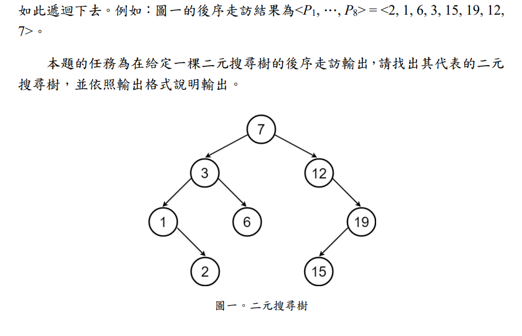

>[題目連結](https://zerojudge.tw/ShowProblem?problemid=k652)
## 問題敘述

給定一棵二元搜尋樹 (BST) 的後序走訪序列，請重建這棵樹，並輸出每個節點的值 Ui 及其父節點 Fi（根為 -1），輸出時按 Ui 遞增排序。

**BST 定義**：
- 左子樹所有值 < 根  
- 右子樹所有值 > 根  
- 左右子樹也為 BST  

**後序走訪**：左 → 右 → 根  

**範例**:


## 輸入格式

- 第一行：正整數 $ N \ (1 \leq N \leq 2 \times 10^5) $，節點數量  
- 第二行：$ N $ 個**互不相同**的正整數 $ P_1, P_2, \dots, P_N \ (1 \leq P_i \leq 10^9) $，為後序走訪序列

## 輸出格式

輸出 $ N $ 行，第 $ i $ 行為兩個整數 $ U_i $ $ F_i $：

- $ U_i $：節點值（保證 $ U_1 < U_2 < \dots < U_N $）
- $ F_i $：$ U_i $ 的父節點值，若為根節點則輸出 `-1`

---

### 範例輸入 1
```
8
2 1 6 3 15 19 12 7
```

### 範例輸出 1
```
1 3
2 1
3 7
6 3
7 -1
12 7
15 19
19 12
```

---

### 範例輸入 2
```
7
7 3 1 9 15 20 16
```

### 範例輸出 2
```
1 9
3 1
7 3
9 15
15 16
16 -1
20 16
```

---

### 範例輸入 3
```
1
2
```

### 範例輸出 3
```
2 -1
```
---

## 解法思路

後序序列最後為根，因此我們可以從右到左處理序列，利用**堆疊 (stack)** 來維護「右子樹路徑」，從而找出每個節點的父節點。

### 核心邏輯

- 後序走訪的最後一個是根，設為 -1（沒有父節點）  
- 由右往左掃：
  - 若當前值小於堆疊頂端，代表它在左子樹
  - 若當前值大於堆疊頂端，pop 直到找到合適位置（右子樹邊界）
  - 根據 pop 結果或堆疊頂端確定父節點

### 複雜度分析
- 時間：O(N log N)（最後 map 排序）
- 空間：O(N)

---

## 完整程式碼（C++）

```cpp
#include <bits/stdc++.h>
using namespace std;

int main() {
    int n;
    cin >> n;
    vector<int> post_order(n);
    for (int i = 0; i < n; i++) {
        cin >> post_order[i];
    }

    map<int, int> parent_map;
    stack<int> st;

    // 最後一個是根
    parent_map[post_order[n - 1]] = -1;
    st.push(post_order[n - 1]);

    for (int i = n - 2; i >= 0; i--) {
        int current = post_order[i];
        int parent = -1;

        while (!st.empty() && st.top() < current) {  // BST: 左小右大
            parent = st.top();
            st.pop();
        }

        if (parent == -1 && !st.empty()) {
            parent = st.top();
        } else if (parent == -1) {
            assert(false); // 理論上不會發生
        }

        parent_map[current] = parent;
        st.push(current);
    }

    for (const auto &entry : parent_map) {
        cout << entry.first << " " << entry.second << '\n';
    }

    return 0;
}
```
### 範例驗證
以範例 1：
```
2 1 6 3 15 19 12 7
```
根 = 7

右子樹 = [12, 19, 15]

左子樹 = [2, 1, 6, 3]

重建後輸出與範例一致 ✅

## 結語
這題結合了 BST 性質 與 堆疊建樹技巧，重點在於掌握「從右往左還原」的過程。
在 N = 2×10⁵ 的限制下，O(N log N) 的 map 排序仍可輕鬆通過。
此解法不僅簡潔，也適合應用於其他樹結構重建問題。

