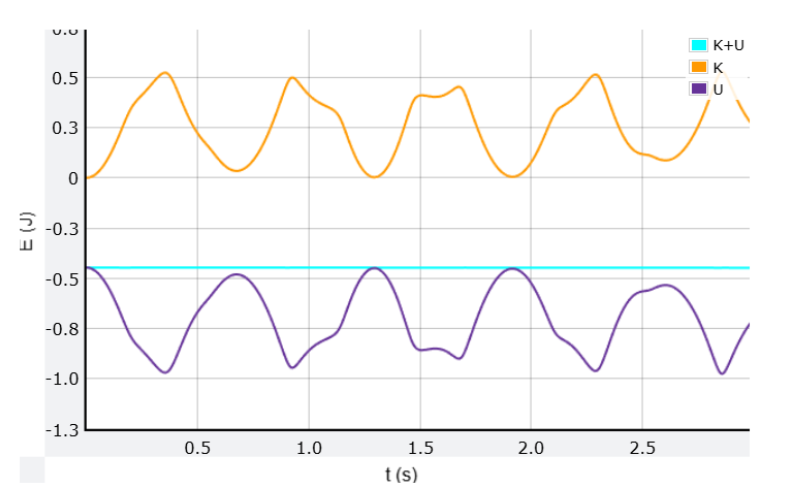

## 系統定義

| 參數       | 符號         | 說明               |
|------------|--------------|--------------------|
| 上擺質量   | $m_1$        | 第一個質點質量     |
| 下擺質量   | $m_2$        | 第二個質點質量     |
| 上擺長度   | $l_1$        | 第一段桿長         |
| 下擺長度   | $l_2$        | 第二段桿長         |
| 重力加速度 | $g$          | 9.8 m/s²           |
| 角度       | $\theta_1, \theta_2$ | 與鉛垂線夾角       |
| 角速度     | $\omega_1, \omega_2$ | $\dot{\theta}_1, \dot{\theta}_2$ |

### 質點坐標

$$
\begin{aligned}
x_1 &= l_1 \sin\theta_1, &\quad y_1 &= -l_1 \cos\theta_1 \\
x_2 &= l_1 \sin\theta_1 + l_2 \sin\theta_2, &\quad y_2 &= -l_1 \cos\theta_1 - l_2 \cos\theta_2
\end{aligned}
$$

## 拉格朗日力學推導

### 總動能 T

$$
\begin{aligned}
T_1 &= \frac{1}{2} m_1 l_1^2 \omega_1^2 \\
T_2 &= \frac{1}{2} m_2 \left( l_1^2 \omega_1^2 + l_2^2 \omega_2^2 + 2 l_1 l_2 \omega_1 \omega_2 \cos(\theta_1 - \theta_2) \right) \\
T &= T_1 + T_2
\end{aligned}
$$

### 總位能 V

$$
V = -(m_1 + m_2) g l_1 \cos\theta_1 - m_2 g l_2 \cos\theta_2
$$

### 拉格朗日量 L

$$
L = T - V
$$

### 運動方程（Euler-Lagrange）

經過繁瑣推導（相信我你不想手算第二次），得到角加速度：

$$
\begin{aligned}
\alpha_1 = \ddot{\theta}_1 &= \frac{
-m_2 l_1 \omega_2^2 \sin(\theta_1 - \theta_2) 
- (m_1 + m_2) g \sin\theta_1 
+ m_2 l_2 \alpha_2 \cos(\theta_1 - \theta_2)
}{
(m_1 + m_2) l_1 - m_2 l_1 \cos^2(\theta_1 - \theta_2)
} \\\
\alpha_2 = \ddot{\theta}_2 &= \frac{
l_1 \omega_1^2 \sin(\theta_1 - \theta_2) 
- g \sin\theta_2 
+ l_1 \alpha_1 \cos(\theta_1 - \theta_2)
}{
l_2
}
\end{aligned}
$$

（完整推導可見參考資料）

### 數值積分（Euler 方法）

每一步更新：

$$
\begin{aligned}
\omega_1(t + \Delta t) &= \omega_1(t) + \alpha_1 \Delta t \\
\omega_2(t + \Delta t) &= \omega_2(t) + \alpha_2 \Delta t \\
\theta_1(t + \Delta t) &= \theta_1(t) + \omega_1(t + \Delta t) \Delta t \\
\theta_2(t + \Delta t) &= \theta_2(t) + \omega_2(t + \Delta t) \Delta t
\end{aligned}
$$

## 模擬結果展示

### 軌跡圖

### 流程圖

### 能量守恆驗證

淺藍線為總能量 → 幾乎完全水平，證明數值模擬正確！

## 參考資料

- [Jousef Murad - Double Pendulum 完整推導](https://www.jousefmurad.com/engineering/double-pendulum-1/)
- [MyPhysicsLab - 互動式雙擺模擬](https://www.myphysicslab.com/pendulum/double-pendulum-en.html)
- Wikipedia: Double Pendulum
---

